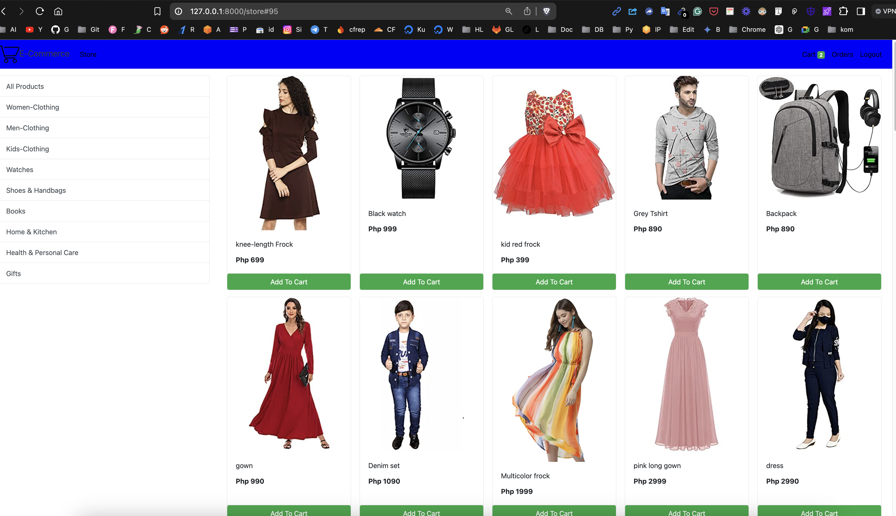

# Django E-commerce Website

## Overview
This is an e-commerce website built using Django, a Python web framework. It provides basic shopping cart functionalities where users can browse products, add them to the cart, and proceed with checkout.

The website utilizes a SQLite database to store products and manage user orders. The Django admin interface allows administrators to manage products, categories, users, and customer orders efficiently.

## Getting Started
Django E-commerce Website

### Installation
1. Clone the repository
2. Open V S Code
3. Click on `File` -> `New Project` and select `Django`.
4. Choose a location for your project and create it.

### Running the Project
Follow these steps to run the Django server locally:

1. Extract/unzip the downloaded file if you haven't already.
2. Navigate into the project directory using the command line.
3. Install Django and Pillow (for image handling):

   ```bash
   pip install Django Pillow


## Viewing the Website

Open your web browser and go to [http://127.0.0.1:8000/](http://127.0.0.1:8000/) to view the website.

## Admin Panel

To access the admin panel:

- **URL:** [http://127.0.0.1:8000/admin/](http://127.0.0.1:8000/admin/)
- **Username:** admin
- **Password:** admin

## Features

### Admin Features

- **Dashboard:** Overview of the entire system including products, orders, users, and categories.
- **Manage Products:** Add, update, and delete products.
- **Manage Orders:** Track and manage customer orders.
- **Manage Categories:** Create and manage product categories.
- **Manage Users:** Admin can manage user accounts.
- **Login and Logout:** Secure authentication system.

### Frontend Features

- **Home Page:** Displays list of products with category filtering.
- **View Products:** Customers can view detailed product information.
- **Checkout Order:** Customers can place orders which are processed by the admin.
- **Customer Profile:** Registration and profile management for customers.
- **Add to Cart:** Temporary cart to hold selected products.

## Project Information

- **Project Name:** E-commerce website using Django
- **Python Version:** 3.12 (Recommended)
- **Programming Language:** Python (Django)
- **Developer:** (github.com/sachnaror/)
- **IDE Tool (Recommended):** Sublime Text, Visual Studio Code
- **Project Type:** Web Application
- **Database:** SQLite





